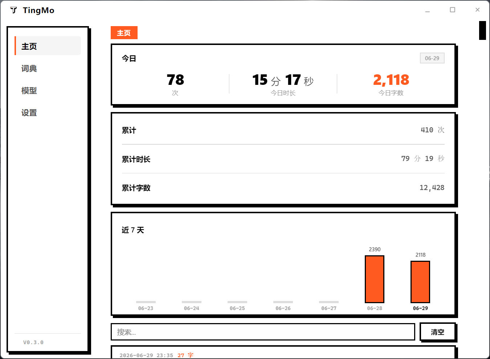

# TingMo 听墨

<p align="center">
  
</p>

<p align="center">
  <strong>Press a hotkey and speak — your words are typed at the cursor in any app.</strong>
</p>

<p align="center">
  
</p>

<p align="center">
  
  
  
</p>

---

Dual-engine recognition (offline + cloud), with built-in AI polish, dictionary correction, and translation.

*[中文版本](README.md) is also available.*

## Features

- **Dual Engine** — Local SenseVoiceSmall (fully offline, 230MB) + Cloud ASR (Volcano Engine / Alibaba Cloud / OpenAI Whisper)
- **AI Polish** — Removes filler words, auto-punctuation, 3 modes, supports 8 LLM providers
- **Translate Hotkey** — Dedicated shortcut triggers translation mode
- **Dictionary** — Custom terminology with fuzzy pinyin matching and correction
- **Streaming Output** — LLM output streams chunk by chunk with typewriter effect
- **5-Language UI** — 简体中文 / 繁體中文 / English / 日本語 / 한국어
- **Minimal UI** — Tray icon + floating capsule appears only during recording

## Installation

Download `TingMo-Setup-0.4.0.exe` from [Releases](https://github.com/shaoxin12/tingmo/releases).

On first launch, choose your speech engine. Selecting local will auto-download the model (~230MB).

## Usage

| Action | Hotkey |
|--------|--------|
| Voice input | Right Alt (customizable) |
| Translate | Right Alt + Right Shift (customizable) |

> Default toggle mode: press to start, press again to stop. Hold mode available in Settings.

## LLM Polish

1. Settings → Model → LLM
2. Enter your API Key (OpenAI / Claude / DeepSeek / Qwen / Gemini supported)
3. Enable "Refine" and pick a style (Light / Balanced / Structured)

Without LLM, the ASR result with built-in punctuation is injected directly — fully offline.

## Tech Stack

Electron 33 · React 18 · TypeScript · SenseVoiceSmall (sherpa-onnx) · Web Audio API · Win32 SendInput (koffi FFI) · Zustand

## Development

```bash
npm install
npm run dev
```

## License

MIT
