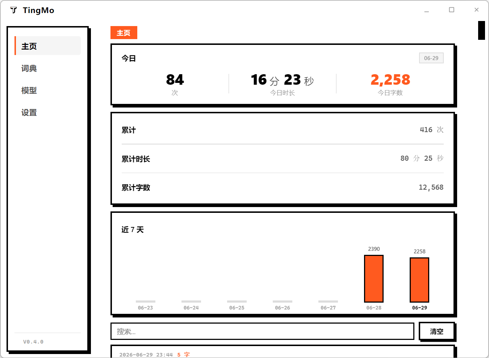

# TingMo 听墨

<p align="center">
  
</p>

<p align="center">
  <strong>Speak. It writes.</strong>
</p>

<p align="center">
  
</p>

<p align="center">
  
  
  
</p>

---

## What is this

TingMo is a **free, lightweight AI voice input tool** for Windows. Press Right Alt, speak, release — your words appear at the cursor. Documents, messages, code comments: your mouth is faster than your fingers.

No vendor lock-in. **Run the local engine offline** — your data stays on your machine. Or plug in OpenAI, Volcano, Alibaba Cloud — your choice. 8 LLMs for text refinement, one hotkey for instant translation.

Open source, tray-resident. No skins, no subscriptions. Just a floating capsule that appears when you speak and vanishes when you're done.

> 🎙️ **Vibe Coding Project** — TingMo is developed through natural language prompting. Code is primarily generated by AI (Claude Code), with humans making directional decisions and reviews.

## Features

### 🎤 Voice Input
- Press a hotkey to start recording, press again (or release) to stop — speech is transcribed and injected at the cursor in real time
- **Streaming injection**: LLM refinement results appear character by character (typewriter effect) as they're generated
- Two record modes: **Toggle** (press to start, press again to stop) and **Hold** (hold to record, release to stop)

### 🌐 Translation
- Dedicated translate hotkey (default: Right Shift + Right Alt)
- Speak and get instant translations in **7 target languages**: English, Chinese, Japanese, Korean, French, German, Spanish
- Translation failures show an error panel in the capsule without injecting wrong text

### 🧠 Dual-Engine Speech Recognition (ASR)

| Engine | Technology | Notes |
|--------|-----------|-------|
| **Local** | SenseVoiceSmall (sherpa-onnx) | Fully offline, ~230MB, 5 languages (zh/en/ja/ko/yue), ITN enabled |
| **Cloud · OpenAI** | Whisper (whisper-1 / large-v3 / large-v3-turbo) | HTTP multipart upload with chunked parallel processing |
| **Cloud · Volcano** | Doubao SeedASR (bigmodel / doubao-seed-asr-2.0) | WebSocket streaming, real-time results during recording |
| **Cloud · Alibaba** | Fun-ASR / Qwen-ASR | WebSocket streaming + HTTP async fallback, DashScope platform |

### ✨ AI Polish (LLM Refinement)
- Optional post-ASR refinement with **three modes**:
  - **Light**: Punctuation + typo fixes, keeps your wording
  - **Balanced** (default): Removes filler words, corrects mistakes, preserves meaning
  - **Structured**: Conversational → structured, with bullet points and formatting

### 📖 Dictionary Correction
- Custom correction pairs with fuzzy pinyin matching and spelling fixes
- Built-in corrections for common tech terms and number formats

### 📊 Stats & History
- Automatically logs every voice session — searchable and reusable

### 🔄 Auto-Update
- GitHub Releases based, auto-checks on startup
- User-triggered download + install-and-restart

### 🌍 5-Language UI
- 简体中文 / 繁體中文 / English / 日本語 / 한국어
- Auto-detects system language on first launch
- Tray menu and tooltip update in sync

### 🔇 Auto-Mute
- Automatically lowers system audio volume while recording to prevent speaker-to-mic feedback

### 🎛️ Customizable Hotkeys
- Voice hotkey: modifier keys (Left/Right Shift, Ctrl, Alt)
- Translate hotkey: extended key support (Insert, F1-F12, Space, etc.)
- Visual hotkey recorder in Settings

---

## Supported LLM Providers (8)

| Provider | Example Models | Auth |
|----------|---------------|------|
| **OpenAI** | gpt-4o-mini, gpt-4.1-nano | Bearer |
| **DeepSeek** | deepseek-v4-flash | Bearer |
| **Kimi (Moonshot)** | moonshot-v1-8k | Bearer |
| **MiniMax** | MiniMax-M2.5 | Bearer |
| **Zhipu AI** | glm-4-flash | Bearer |
| **Google Gemini** | gemini-2.5-flash | API Key (Query) |
| **Volcano Engine** | doubao-seed-2.1-turbo | Bearer |
| **Ollama** | llama3.2 (configurable) | None |

---

## Installation

Download the latest installer from [Releases](https://github.com/shaoxin12/tingmo/releases). If Windows blocks the installer, right-click → Properties → check "Unblock".

**Requirements**: Windows x64

On first launch, the onboarding wizard guides you through:
1. **Local engine**: Auto-downloads the model (~230MB, HuggingFace mirrors), then works entirely offline
2. **Cloud engine**: Requires API key configuration in Settings, offers higher accuracy

**Data storage**:
- Settings & stats: `%APPDATA%/TingMo/data/`
- Local model: `%APPDATA%/TingMo/models/funasr/`
- ⚠️ API keys stored as plaintext in `settings.json` — secure your local machine

---

## Usage

| Action | Default Hotkey | Notes |
|--------|---------------|-------|
| Voice Input | **Right Alt** | Press to start/stop (Toggle) or hold to record (Hold) |
| Translate | **Right Shift + Right Alt** | Auto-translates after recognition |
| Cancel | Esc | Discard current recording |
| Settings | Left-click tray icon | Configure engine, API keys, hotkeys, language, etc. |

### Tray Icon States

| Color | State |
|-------|-------|
| Default | Idle |
| 🔴 Red | Recording |
| 🔵 Blue | Recognizing |

Right-click the tray icon for quick actions: switch Local/API, Toggle/Hold mode, mute, settings, quit.

---

## Tech Stack

| Layer | Technology | Version |
|-------|-----------|---------|
| Framework | Electron + React + TypeScript | 33 / 18 / 5.6 |
| Build (Main) | esbuild | 0.28 |
| Build (Renderer) | Vite | 6.0 |
| Local ASR | sherpa-onnx (SenseVoiceSmall) | 1.13 |
| ONNX Runtime | onnxruntime-node | 1.26 |
| Cloud ASR | Volcano WS / Alibaba Fun-ASR WS / OpenAI HTTP | — |
| LLM | OpenAI-compatible SSE streaming + Gemini | — |
| Audio | Web Audio API → 48→16kHz anti-alias resample → WAV | — |
| Text Injection | Win32 `SendInput` + `KEYEVENTF_UNICODE` (koffi FFI) | 2.16 |
| Global Hotkeys | `SetWindowsHookExW` (koffi FFI) | — |
| Pinyin | pinyin | 4.0 |
| State | Zustand | 5.0 |
| Auto-Update | electron-updater | 6.3 |
| Packaging | electron-builder (NSIS installer) | 25.1 |
| Testing | tsx (built-in test runner) | 4.22 |

### Architecture

```
┌──────────────────────────────────────┐
│           Main Process              │
│  hotkey.ts     main.ts     tray.ts  │
│  (keyboard hook)(orchestrator)(tray)│
│  text-inserter.ts  stats-history.ts │
│  (text injection)  (stats/DB)       │
└──────────┬──────────────────────────┘
           │  IPC (contextBridge)
┌──────────┴──────────────────────────┐
│         Renderer Process            │
│  FloatingWindow.tsx  (capsule UI)   │
│  Settings/           (settings UI)  │
│  useAudioCapture.ts  (audio capture)│
│  services/           (ASR/LLM)      │
└─────────────────────────────────────┘
```

**State machine**: `IDLE → RECORDING → RECOGNIZING → REFINING → SUCCESS → IDLE`

- 15-second watchdog: stuck RECOGNIZING auto-resets to IDLE
- Any non-IDLE state + hotkey press = force reset

---

## Development

```bash
# Install dependencies
npm install

# Start dev environment (Vite + esbuild + Electron, main process hot reload)
npm run dev

# Build main process only
npm run build:main

# Full build
npm run build

# Package installer
npm run electron:build

# Release patch version
npm run release:patch

# Run tests
npm run test:unit
```

### Known Limitations
- Windows x64 only
- SenseVoiceSmall accuracy is limited — pair with LLM refinement or use cloud ASR for best results
- API keys stored as plaintext in local JSON file
- Translate hotkey set to a standalone key blocks that key system-wide (e.g., Insert)
- Voice hotkey only supports modifier keys (Shift, Ctrl, Alt)

---

## License

MIT

## Credits

TingMo is developed by [@shaoxin12](https://github.com/shaoxin12) using Vibe Coding — code primarily generated by Claude Code. Thanks to these open-source projects:

- [sherpa-onnx](https://github.com/k2-fsa/sherpa-onnx) — Local speech recognition engine
- [koffi](https://github.com/Koromix/koffi) — High-performance FFI for Node.js
- [Zustand](https://github.com/pmndrs/zustand) — Lightweight state management
- [electron-builder](https://github.com/electron-userland/electron-builder) — Packaging & distribution
